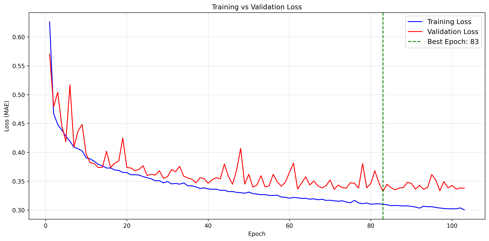

<h1> California Housing Price Predictor (PyTorch)</h1>

An end-to-end <strong>Machine Learning project</strong> using <strong>PyTorch</strong> to predict housing prices in California.
This project demonstrates a complete ML workflow — from <strong>exploratory data analysis (EDA)</strong> to a
<strong>multi-task neural network</strong> capable of both regression and classification.

<h2> Project Overview</h2>

The California Housing Price Predictor showcases best practices in modern machine learning, including
robust data preprocessing, dynamic neural network design, automated hyperparameter tuning,
early stopping, and comprehensive evaluation.

<h2> Key Features</h2>

<h3> Custom Dynamic Neural Network</h3>
<ul>
  <li>Flexible <code>NeuralNetwork</code> class</li>
  <li>Dynamically scales hidden layers and units</li>
  <li>ReLU activations throughout the network</li>
  <li>Task-specific outputs:
    <ul>
      <li>Regression head for price prediction</li>
      <li>Sigmoid classification head for affordability</li>
    </ul>
  </li>
</ul>

<h3> Robust Data Pipeline</h3>
<ul>
  <li>Automated dataset fetching</li>
  <li>Multi-stage splitting (Training / Validation / Test)</li>
  <li>Feature normalization using <code>StandardScaler</code></li>
</ul>

<h3> Automated Hyperparameter Tuning</h3>
<ul>
  <li>Grid search using <code>itertools.product</code></li>
  <li>Tuned parameters:
    <ul>
      <li>Learning rate</li>
      <li>Batch size</li>
      <li>Network depth</li>
    </ul>
  </li>
  <li>Results saved for reproducibility</li>
</ul>

<h3> Early Stopping Logic</h3>
<ul>
  <li>Custom training loop</li>
  <li>Patience counter with <code>min_delta</code> threshold</li>
  <li>Prevents overfitting by monitoring validation loss</li>
</ul>

<h3> Visualization Suite</h3>
<ul>
  <li>Geographical housing price maps</li>
  <li>Pearson correlation heatmaps</li>
  <li>Training vs. validation loss curves</li>
</ul>

<h2> Performance Metrics</h2>

<h3>Regression Task</h3>
<ul>
  <li>Mean Absolute Error (MAE)</li>
  <li>Mean Squared Error (MSE)</li>
  <li>Root Mean Squared Error (RMSE)</li>
  <li>R2 Score</li>
</ul>

<h3>Classification Task</h3>
<ul>
  <li>Accuracy</li>
  <li>Precision</li>
  <li>Recall</li>
  <li>F1-Score</li>
  <li>Confusion Matrix</li>
</ul>

Housing affordability is determined using a <strong>median house value threshold</strong>.

<h2> Visualizations</h2>

<h3> Geographical Distribution</h3>

  

  <em>Housing prices mapped by longitude and latitude, highlighting high-value coastal regions.</em>

<h3> Feature Correlations</h3>

  

  <em>Pearson correlation heatmap showing relationships between features and target price.</em>

<h3> Training Progress</h3>

  

  <em>Training and validation loss with early stopping applied.</em>

<h2> Getting Started</h2>

<h3>Prerequisites</h3>

<pre><code>pip install torch scikit-learn pandas seaborn matplotlib numpy</code></pre>

<h3>Usage</h3>

<ol>
  <li>Clone the repository</li>
  <li>Run the main script:</li>
</ol>

<pre><code>python Cali_Housing_Market.py</code></pre>

This will perform EDA, hyperparameter tuning, model training, evaluation, and visualization generation.

<h2> Project Structure</h2>

<pre><code>
├── Cali_Housing_Market.py
├── hyperparameter_results.csv
├── *.png
└── README.md
</code></pre>
